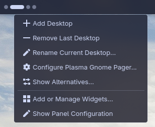
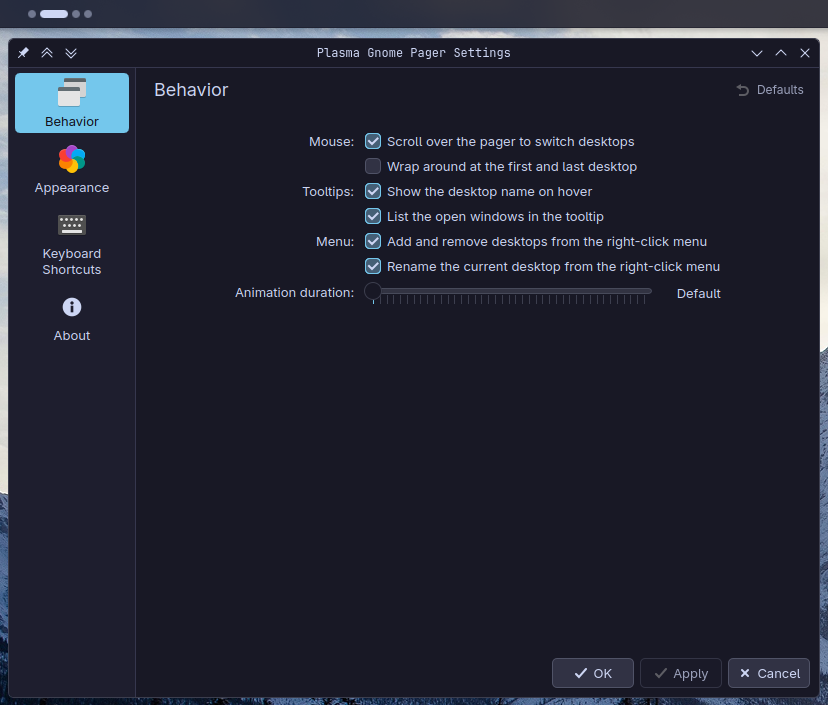
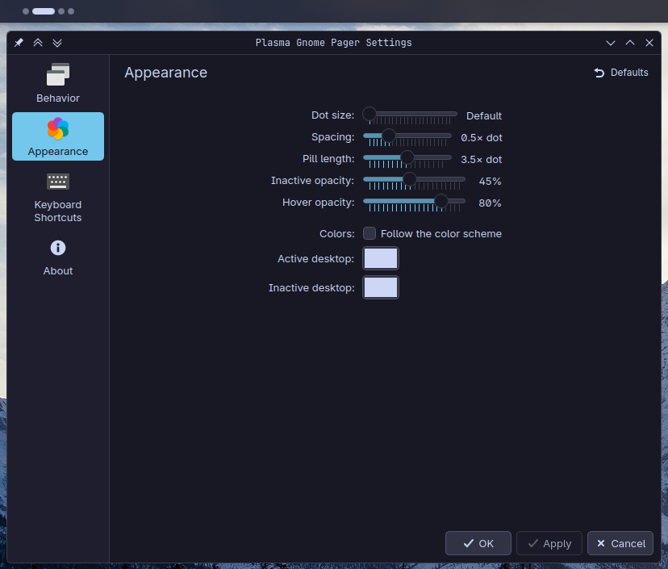

# Plasma Gnome Pager (Plasma 6)

A GNOME-style virtual-desktop switcher for KDE Plasma 6 panels: dim dots, with a highlighted
**pill** that morphs over the current workspace.

## Screenshots


> The animation above is captured at the panel's native height (~48 px tall), so its
> resolution is necessarily low — it looks crisp at real size in your panel.

| Theme highlight (default) | Custom pill colour |
|---|---|
|  |  |

On a **vertical side panel** the row of dots becomes a column and the pill grows vertically —
the same widget, transposed:


| Vertical — theme highlight (default) | Vertical — custom pill colour |
|---|---|
|  |  |

| Right-click menu | Settings — Behavior | Settings — Appearance |
|---|---|---|
|  |  |  |

## Features

- **Live dot strip** — one dim circle per virtual desktop, in order, sized via
  `Kirigami.Units` (HiDPI-correct on fractional scaling).
- **Reflow / morph pill** — the active desktop's dot morphs in place into a wider highlighted
  capsule; the strip reflows around it (no overlay), so the pill-to-dot gap matches the
  dot-to-dot gap for the signature GNOME look. The first placement is instant (no grow-in on
  shell reload); later switches animate, and motion respects the "reduce animations" setting.
- **Reactive** — bound to `VirtualDesktopInfo`, so switches made from the keyboard, another
  pager, or KWin settings update the widget immediately (state is never cached).
- **Click & scroll to switch** — click a dot, or scroll over the strip (with optional
  wrap-around); hi-res/touchpad sub-notches are accumulated.
- **Hover & tooltips** — dots brighten on hover; each dot has a tooltip with the desktop name
  and, optionally, a GNOME / stock-pager-style list of the windows open on that desktop
  (sourced from the public `TasksModel`).
- **Add / remove / rename desktops** — from the right-click menu (each entry individually
  toggleable; never removes the last desktop).
- **Works everywhere a pager goes** — **a vertical side panel behaves identically to a
  horizontal one** (the row of dots becomes a column and the pill grows vertically), plus a
  multi-row grid that mirrors KWin's "Rows" setting live. On a thin or crowded panel the dots
  **scale to fit** on both axes rather than overflowing onto neighbours.
- **Per-screen current desktop** — Plasma 6.7's "switch desktops independently for each
  screen": each pager reflects *its* monitor's current desktop, not the global one.
- **Theme-following, or your own colours** — by default dim dots use the text colour at reduced
  opacity and the pill uses the highlight colour, so the widget follows your colour scheme; you
  can also pin custom active/inactive colours.
- **Configurable** — a full settings dialog (Behavior + Appearance) with a Defaults action;
  see [Configuration](#configuration).

## Why this exists

Several third-party GNOME-style pagers break across Plasma point releases (e.g. 6.6 → 6.7)
because they depend on **private** QML imports (`org.kde.plasma.private.*`) or ship a compiled
C++ plugin. This widget is deliberately built to be robust:

- **Pure QML** — no compiled plugin, so Qt/KF6 upgrades can't break it.
- **Public, stable, versionless imports only** — `org.kde.plasma.plasmoid`,
  `org.kde.plasma.core`, `org.kde.kirigami`, `org.kde.taskmanager` (`VirtualDesktopInfo` for
  reading state, `TasksModel` for the window-list tooltips), and `org.kde.plasma.workspace.dbus`
  (KWin DBus for switching/adding/removing). No `org.kde.plasma.private.*`.
- **Reactive bindings** to `VirtualDesktopInfo` so the pill always reflects the real state,
  including switches made via keyboard or other widgets.

It was built on Plasma 6.6.5, survived the upgrade to 6.7, and gained per-screen desktop
support through the public API alone — no rebuild required.

## Requirements

- KDE Plasma 6.0+ on KDE Frameworks 6 and Qt 6 (developed on Plasma 6.6/6.7, Qt 6.11, Fedora KDE)
- `kpackagetool6`, `plasmawindowed` (from `plasma-workspace`)

## Install / uninstall

### From source

```bash
make install    # kpackagetool6 --install package
make update     # kpackagetool6 --upgrade package
make uninstall  # kpackagetool6 --remove <id>
make package    # build a distributable .plasmoid into dist/
```

If you've run `make dev` (the live-editing symlink, below), run `make dev-undev` first — the
install/upgrade targets refuse to run while the dev symlink is present (otherwise
kpackagetool6's remove-then-install step would delete your source tree through the symlink).

Widget id: `com.github.kenansalar.plasma-gnome-pager`

### From a release (`.plasmoid`)

Each tagged release attaches a ready-to-install `.plasmoid` — grab the latest from the
[**Releases**](https://github.com/KenanSalar/plasma-gnome-pager/releases) page and install it
with either:

```bash
kpackagetool6 --type Plasma/Applet --install com.github.kenansalar.plasma-gnome-pager-<version>.plasmoid
```

or the GUI: right-click the desktop/panel → **Add Widgets… → Get New Widgets… → Install Widget
From Local File…**.

### KDE Store

Published on the KDE Store: **[Plasma Gnome Pager](https://store.kde.org/p/2363190)** (also on
[OpenDesktop](https://www.opendesktop.org/p/2363190/)). Install it straight from the desktop:
right-click the panel or desktop → **Add Widgets… → Get New Widgets… → Download New Plasma
Widgets**, then search for "Plasma Gnome Pager".

## Configuration

Right-click the widget → **Configure…**. Every setting applies live and persists across a shell
restart; the defaults give the intended GNOME look out of the box.

### Behavior

| Setting | Default | Description |
|---|---|---|
| `enableScroll` | `true` | Scroll over the strip to switch desktops. |
| `scrollWrap` | `false` | When scrolling past the first/last desktop, wrap around (else clamp). |
| `showTooltips` | `true` | Show the desktop name in a tooltip on hover. |
| `showWindowList` | `true` | Also list the windows open on a desktop in its tooltip (only applies when tooltips are on). |
| `enableAddRemove` | `true` | Offer Add / Remove Desktop entries in the right-click menu. |
| `enableRename` | `true` | Offer a "Rename Current Desktop…" entry in the right-click menu. |
| `animationDuration` | `0` | Morph animation length in ms; **0 = follow the theme** (`Kirigami.Units.longDuration`, which also inherits "reduce animations"). |

### Appearance

| Setting | Default | Description |
|---|---|---|
| `dotSize` | `0` | Inactive-dot diameter in px; **0 = auto** (`Kirigami.Units.iconSizes.small / 2`, HiDPI-aware). |
| `pillSize` | `0` | Active-pill thickness in px, sized **independently of the dots** (e.g. a normal pill over tiny dots); **0 = auto** (matches the dot size, so the pill tracks the dots by default). |
| `spacingFactor` | `0.5` | Uniform gap between elements, as a multiple of the dot size (GNOME-tight at 0.5). |
| `pillWidthFactor` | `3.5` | Active-capsule length, as a multiple of the **pill thickness** (its aspect ratio). |
| `inactiveOpacity` | `0.45` | Opacity of an inactive (dim) dot. |
| `hoverOpacity` | `0.8` | Opacity an inactive dot brightens to on hover. |
| `followThemeColors` | `true` | Follow the colour scheme (active = highlight, inactive = text colour). When off, use the two colours below. |
| `activeColor` | `#3daee9` | Custom active-capsule colour (used only when `followThemeColors` is off). |
| `inactiveColor` | `#eff0f1` | Custom inactive-dot colour (used only when `followThemeColors` is off). |

The **multi-row grid** and the **per-screen current desktop** are not settings — they
auto-mirror KWin (System Settings → Virtual Desktops → "Rows", and the per-output desktop
feature), so they always agree with the rest of the system.

## Project layout

```
plasma-gnome-pager/
├── Makefile                 # dev / install / package / test helpers
├── README.md
├── CLAUDE.md                # architecture & conventions (authoritative)
├── LICENSE                  # GPL-3.0-or-later (full text)
├── .gitignore
├── .contextProperties.ini   # declares i18n/Plasmoid globals so qmllint stays clean
├── .github/                 # CI workflows (PR validation, PR-source guard, publish) + CODEOWNERS
├── screenshots/             # README media (not shipped in the package)
├── po/                      # translation source: per-language *.po (the *.pot template is generated)
├── tests/                   # headless QML tests (not shipped in the package)
│   ├── README.md
│   ├── unit/                       # one component in isolation (+ pure-JS logic)
│   ├── integration/                # components composed + reactive wiring
│   └── shared/                     # shared test helpers / mocks
└── package/                 # the KPackage (this is what gets installed)
    ├── metadata.json
    └── contents/
        ├── config/
        │   ├── main.xml              # KConfigXT schema (the settings keys)
        │   └── config.qml            # ConfigModel: the settings categories
        ├── locale/                   # compiled *.mo catalogs (generated by `make i18n`)
        └── ui/
            ├── main.qml              # PlasmoidItem root: data source, DBus helpers, actions
            ├── WorkspaceIndicator.qml # the dot strip (row / column / grid + reflow)
            ├── WorkspaceDot.qml       # one element (dot ⇄ capsule morph + tooltip)
            ├── logic.js               # pure, unit-tested branching logic (no Plasma deps)
            └── config/                # settings pages (ConfigGeneral, ConfigAppearance, …)
```

## Development

```bash
make dev                # symlink package/ into ~/.local/share/plasma/plasmoids for live editing
make test               # run the widget standalone in a window (shows QML errors in the terminal)
make restart            # reload plasmashell to pick up changes in the panel
make check              # run all headless QML tests — unit + integration (see tests/README.md)
make check-unit         # run only the unit tier (tests/unit)
make check-integration  # run only the integration tier (tests/integration)
make lint               # qmllint the widget UI + config pages + tests
make package            # build a distributable .plasmoid into dist/
make messages           # extract translatable strings into po/ (.pot + merge .po files)
make i18n               # compile po/*.po into the package (contents/locale/.../*.mo)
make dev-undev          # remove the dev symlink
```

The tests cover the Kirigami-only components (`WorkspaceDot`, `WorkspaceIndicator` driven by a
mock `VirtualDesktopInfo`, and the pure `logic.js`); `main.qml` needs a live plasmashell + KWin
session, so it is verified by the manual `make dev` → `make test` → `make restart` loop.

## Translations

The widget ships **English** (the source language) plus **12 translation catalogs**: Arabic
(`ar`), Simplified Chinese (`zh_CN`), French (`fr`), German (`de`), Greek (`el`), Italian
(`it`), Japanese (`ja`), European Portuguese (`pt`), Brazilian Portuguese (`pt_BR`), Russian
(`ru`), Spanish (`es`), and Turkish (`tr`). All user-visible strings are translated through
`ki18n`; Plasma auto-binds them to the catalog domain
`plasma_applet_com.github.kenansalar.plasma-gnome-pager`. The committed translation source is the
per-language `po/*.po`; the `*.pot` template is regenerated from the QML by `make messages` and the
compiled `*.mo` catalogs are generated into `package/contents/locale/<lang>/LC_MESSAGES/` by
`make i18n` (so `make install`/`update`/`dev` ship them automatically) — both are gitignored.

**Contributing a translation** — say, Korean:

```bash
make messages                              # refresh po/*.pot from the current strings
msginit --locale=ko -i po/plasma_applet_com.github.kenansalar.plasma-gnome-pager.pot -o po/ko.po
$EDITOR po/ko.po                           # translate each msgstr (Lokalize / Poedit work well)
make i18n                                  # compile, then `make restart` to see it in the panel
```

Open a pull request with the new `po/ko.po` (and, optionally, a `Description[ko]` key in
`package/metadata.json` so the description in **Add Widgets** is localized too). After changing
any in-code string, re-run `make messages` and commit the updated `.po` (the `.pot` is gitignored).

## License

GPL-3.0-or-later. See [LICENSE](LICENSE).
